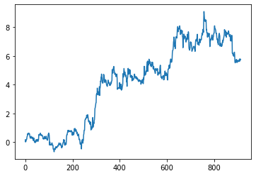

<h2 align="center">The World's First Live Open-Source Trading Algorithm</h2>    

Use our money to test your automated stock/FX/crypto trading strategies. All changes users make to our Python GitHub code are added to the repo, and then reflected in the live trading account that goes with it. You can also use that same code to trade with your own money. We have spent over 10 years developing automated trading strategies, and are open sourcing all of our programming (meaning it is free for anybody to use) in the hopes that users will help improve it. Here is some of what we have learned so far from doing automated trading:

<ul>
<li>Backtests are great to use for developing strategies but are somewhat meaningless in predicting actual profits. The only way to know how well your strategy works is to trade it live. </li>
<li>There are all sorts of issues that come up in live trading which are not reflected accurately in backtesting (or paper trading). For example, even if you do a good job estimating the brokerage fees and the bid/ask spread, they will almost always end up being worse in real trading. Limit orders can help with this slippage in live trading but are almost impossible to backtest because they would almost never get filled on the price the backtester shows.</li>
<li>It is very hard to go from backtesting to live trading. Most backtesting systems do not support live trading, at least not without additional programming.  </li>
<li>Very few backtesting and trading programs support machine learning (using artificial intelligence to predict the price). They only allow you to create a strategy using the standard list of indicators (moving average, Bollinger bands, RSI, etc.).   </li>
<li>The best way to combine multiple strategies is to use machine learning (ML). ML automatically determines which strategies are best to use at what times, and can be easily retrained with new data. Otherwise, strategies that backtested well may work for a little while and then become old and stop working.</li>
<li>High frequency trading (HFT) is only worth pursuing if you are trading millions of dollars and are willing to spend thousands of dollars a month on quant technologies. This is not something we are interested in doing.</li>
</ul>

                
There are 2 main ways to improve our existing ML trading algorithm:

<ol>
<li>Increase the accuracy by trying new machine learning methods. For example, there are always new types of neural networks that could be tested, or new time series prediction libraries that could be used. That similar to how they do it in the contest at <A HREF="http://numer.ai" target="new">Numerai</a>, but the problem with Numerai is that all of the data is anonymous and encrypted. You have no idea what financial instruments and indicators/features you are working with. So if you come up with something good, there is no easy way to apply it to real trading for yourself.  </li>
<li>Add new features to help the ML model learn better. Features can be new technical indicators or a complete strategy that gives buy and sell signals. The ML combines these new indicators and strategies with all of the existing ones, to improve on the model it already has. This is similar to the contests at <A HREF="https://www.kaggle.com/competitions?sortBy=relevance&group=general&search=stock&page=1&pageSize=20" target="new">Kaggle.com</a>, but Kaggle rarely deals with stocks, and when they do it, it is still hard to apply the results to real trading. </li>
</ol>

<h2>What We Have Working So Far</h2>    
  
<UL>
<LI>Backtester with stock, FX, and crypto data.</LI>
<LI>100+ indicators from TA-Lib (ta-lib.org) plus some we created ourselves, added as features. Also various time series features such as ARIMA, SARIMA, ARIMAX, and SARIMAX.</LI>
<LI>Optimization of the 40,000+ indicator paramater combinations, using feature reduction to find which ones work best.</LI>
<LI>Over 60 classification and regression algorithms and neural networks using our custom made AutoML program.</LI>
<LI>ML model parameter optimization using Skopt, genetic algorithm, or exhaustive search.
<LI>Voting ensembles and stacking of algorithms to acheive higher accuracy.</LI>
<LI>Tests using evolutionary algorithms (such as NEAT) and genetic programming (such as gplearn).</LI>
<LI>Tests using reinforcement learning algorithms such as policy gradient, Q-learning, evolution strategy, actor-critic, curiosity Q-learning, and neuroevolution with novelty search.</LI>
<LI>Over a dozen dimensionality reduction techniques for selecting the best features, such as PCA, RandomTreesEmbedding, LDA, SelectKBest, SelectFromModel, SymbolicTransformer, GeneticSelectionCV,  SNERBFSampler, RFECV, FastICA, Isomap, SpectralEmbedding, FeatureAgglomeration, and LocallyLinearEmbedding.</LI>
<LI>Coming Soon - Over 1000 new features from various MetaTrader indicators and strategies. These can be used on anything, not just FX.</LI>
<LI>Coming Soon - Live trading. We have the ability to trade live right now, but we want to make the algorithm more profitable before we do that.</LI>
</UL>

Below are the accuracy results (classification) on unseen test data using 4 years of hourly EURUSD data, with a 75%/25% train/test split: 
('GradientBoostingClassifier', 0.5296564758688427) 
('DefragTreesClassifier', 0.5285995785545385) 
('AdaBoostClassifier', 0.5284508885900469) 
('LogisticRegression', 0.5275165208048028) 
('XGBClassifier', 0.5274430345331051) 
('LinearSVC', 0.526926169397467) 
('BernoulliNB', 0.5263609141082636) 
('BinaryLogitBoost', 0.5171396629815084) 
('GaussianNB', 0.5140903999668127) 
('BaggingClassifier', 0.5044507753853887) 
('DecisionTreeClassifier', 0.4989915412173202) 
('ExtraTreesClassifier', 0.49980348832413685) 
('RandomForestClassifier', 0.5082132821719233) 
('KNeighborsClassifier', 0.5005655757938446) 
('MLPClassifier', 0.5107957755311275) 
('SGDClassifier', 0.5160573853279747) 
('ArcX4', 0.5077704717501768) 
('IsolationForest', 0.44828611654927536) 
('PassiveAggressiveClassifier', 0.4980822393139217) 
('KmeansClustering', 0.5108936443445867) 
('QuadraticDiscriminantAnalysis', 0.4976636723470168) 
('ClassSwitching', 0.5058771117476321) 
('BinaryVadaboost', 0.5002951908218114) 
('GentleBoostClassifier', 0.5) 
('LogitBoostClassifier', 0.3999262355544627) 
('RidgeClassifier', 0.5271228322547648) 
('CatBoostClassifier', 0.526828191733375) 
('InfiniteBoostingWithHoldoutCLF', 0.5) 
('InfiniteBoostingCLF', 0.49992623555446275) 
('ResearchGradientBoostingBaseCLF', 0.5) 
('mlxtendPerceptron', 0.5057056357173275) 
('LightGBM', 0.5) 
 
And here's the backtest results (exit trade at the end of each 1 hour bar, no commissions/slippage) on the unseen test set, using XGBoost: 

<h2>Roadmap For The Future</h2>     
 
                                Suggested improvements for users to try:  
<OL>
<LI><B>Use these programs to get new features:</B> 
TSFresh:  <a href='https://github.com/blue-yonder/tsfresh' target = "new">https://github.com/blue-yonder/tsfresh</a> 
Cesium: <a href='https://github.com/cesium-ml/cesium' target = "new">https://github.com/cesium-ml/cesium</a> 
PyAF: <a href='https://github.com/antoinecarme/pyaf' target = "new">https://github.com/antoinecarme/pyaf</a> 
TSLearn - <a href='https://github.com/rtavenar/tslearn' target = "new">https://github.com/rtavenar/tslearn</a> 
pyts:  <a href='https://github.com/johannfaouzi/pyts' target = "new">https://github.com/johannfaouzi/pyts</a> 
Time Series Feature Extraction Library: <a href='https://github.com/fraunhoferportugal/tsfel' target="new">https://github.com/fraunhoferportugal/tsfel</a> 
Khiva:  <a href='https://github.com/shapelets/khiva' target = "new">https://github.com/shapelets/khiva</a> (C++) or <a href='https://github.com/shapelets/khiva-python' target = "new">https://github.com/shapelets/khiva-python</a> (python bindings) 
PyFTS: <a href='https://github.com/PYFTS/pyFTS' target = "new">https://github.com/PYFTS/pyFTS</a> 
Genetic Discovert of Shapelets: <a href='https://github.com/IBCNServices/GENDIS' target = "new">https://github.com/IBCNServices/GENDIS</a> 
PyFlux: <a href='https://github.com/RJT1990/pyflux' target = "new">https://github.com/RJT1990/pyflux</a> 
Deep Learning for Time Series Classification:  <a href='https://github.com/cauchyturing/UCR_Time_Series_Classification_Deep_Learning_Baseline' target = "new">https://github.com/cauchyturing/UCR_Time_Series_Classification_Deep_Learning_Baseline</a> 
PMDARIMA: <a href='https://github.com/tgsmith61591/pmdarima' target = "new">https://github.com/tgsmith61591/pmdarima</a> 
Stumpy: <a href='https://github.com/TDAmeritrade/stumpy' target = "new">https://github.com/TDAmeritrade/stumpy</a> 
Feets: <a href='https://github.com/carpyncho/feets' target = "new">https://github.com/carpyncho/feets</a> 
Thalesians' Time Series Analysis (TSA) - <a href='https://github.com/thalesians/tsa' target = "new">https://github.com/thalesians/tsa</a> (notebooks at <a href='https://github.com/thalesians/tsa/tree/master/src/jupyter/python' target = "new">https://github.com/thalesians/tsa/tree/master/src/jupyter/python</a>) - Made specifically for stock time series analysis. 
SLearn: <a href='https://github.com/mzoll/slearn' target="new">https://github.com/mzoll/slearn</a> 

Also: 
A) There is good code/info for ARCH, GARCH, and EGARCH:  <a href='https://0xboz.github.io/blog/understand-and-model-cryptocurrencies-volatility-using-garch-variants/'>https://0xboz.github.io/blog/understand-and-model-cryptocurrencies-volatility-using-garch-variants/</a> 
B) If you need a faster version of Fourier Transform, see <a href='https://github.com/ShihuaHuang/Fast-Fourier-Transform'>https://github.com/ShihuaHuang/Fast-Fourier-Transform</a> 
C) If you have not already used Dynamic Time Warping (DTW), here's info for it: 
TSLearn - <a href='https://github.com/rtavenar/tslearn'>https://github.com/rtavenar/tslearn</a> 
pyts:  <a href='https://github.com/johannfaouzi/pyts'>https://github.com/johannfaouzi/pyts</a> 
See these articles about how it can be used in a nearest neighbors sort of way to find stock price patterns that are similar to the current one: <a href='https://systematicinvestor.wordpress.com/2012/01/20/time-series-matching-with-dynamic-time-warping/'>https://systematicinvestor.wordpress.com/2012/01/20/time-series-matching-with-dynamic-time-warping/</a> and <a href='https://systematicinvestor.wordpress.com/2012/01/13/time-series-matching/'>https://systematicinvestor.wordpress.com/2012/01/13/time-series-matching/</a> ).  
Other DTW programs: 
<a href='https://github.com/wannesm/dtaidistance'>https://github.com/wannesm/dtaidistance</a> 
<a href='https://github.com/markdregan/K-Nearest-Neighbors-with-Dynamic-Time-Warping'>https://github.com/markdregan/K-Nearest-Neighbors-with-Dynamic-Time-Warping</a> 
<a href='https://github.com/pierre-rouanet/dtw'>https://github.com/pierre-rouanet/dtw</a> 
<a href='https://github.com/fpetitjean/DBA'>https://github.com/fpetitjean/DBA</a> 
</LI>
 
<LI><B>Try these probabilistic modeling programs:</B> 
A) <a href='https://github.com/tensorflow/probability' target = "new">https://github.com/tensorflow/probability</a>  (Includes Edward) 
B) <a href='http://pyro.ai/' target = "new">http://pyro.ai/</a> (From Uber Labs) 
C) <a href='https://brancher.org' target = "new">https://brancher.org</a> (see their time series module) 
D) Pomegranate - <a href='https://github.com/jmschrei/pomegranate' target = "new">https://github.com/jmschrei/pomegranate</a>  
</LI>
 
<LI><B>More programs to get features/predictions from:</B> 
1. SKTime: 
    <a href='https://github.com/alan-turing-institute/sktime/blob/master/examples/time_series_classification.ipynb' target = "new">https://github.com/alan-turing-institute/sktime/blob/master/examples/time_series_classification.ipynb</a> 
    <a href='https://github.com/alan-turing-institute/sktime/blob/master/examples/forecasting.ipynb' target = "new">https://github.com/alan-turing-institute/sktime/blob/master/examples/forecasting.ipynb</a> 
    <a href='https://github.com/alan-turing-institute/sktime/blob/master/examples/shapelet_transform.ipynb' target = "new">https://github.com/alan-turing-institute/sktime/blob/master/examples/shapelet_transform.ipynb</a> 
1.5 Skits - <a href='https://github.com/EthanRosenthal/skits' target = "new">https://github.com/EthanRosenthal/skits</a> - Scikit-inspired time series. 
2. Stock Prediction AI - <a href='https://github.com/borisbanushev/stockpredictionai' target = "new">https://github.com/borisbanushev/stockpredictionai</a> 
3. Facebook Prophet at <a href='https://facebook.github.io/prophet/' target = "new">https://facebook.github.io/prophet/</a> . Also see <a href='https://github.com/CollinRooney12/htsprophet' target = "new">https://github.com/CollinRooney12/htsprophet</a> and <a href='https://github.com/advaitsave/Introduction-to-Time-Series-forecasting-Python/blob/master/Time%20Series%20in%20Python.ipynb' target = "new">https://github.com/advaitsave/Introduction-to-Time-Series-forecasting-Python/blob/master/Time%20Series%20in%20Python.ipynb</a> . 
4. Statsmodels:  Try all the methods at <a href='https://github.com/statsmodels/statsmodels' target = "new">https://github.com/statsmodels/statsmodels</a> 
5. Shapelets (MLP): <a href='https://github.com/mohaseeb/shaplets-python' target = "new">https://github.com/mohaseeb/shaplets-python</a> 
6. 11 methods from <a href='https://machinelearningmastery.com/time-series-forecasting-methods-in-python-cheat-sheet/' target = "new">https://machinelearningmastery.com/time-series-forecasting-methods-in-python-cheat-sheet/</a> 
7. Deep Learning for Time Series Classification: <a href='https://github.com/hfawaz/dl-4-tsc' target = "new">https://github.com/hfawaz/dl-4-tsc</a> - Various methods in Keras 
8. ES-RNN - <a href='https://github.com/damitkwr/ESRNN-GPU' target = "new">https://github.com/damitkwr/ESRNN-GPU</a>  (also maybe at <a href='https://github.com/M4Competition/M4-methods/tree/master/118%20-%20slaweks17' target = "new">https://github.com/M4Competition/M4-methods/tree/master/118%20-%20slaweks17</a> ) 
9. Keras: <a href='https://github.com/jaungiers/LSTM-Neural-Network-for-Time-Series-Prediction' target = "new">https://github.com/jaungiers/LSTM-Neural-Network-for-Time-Series-Prediction</a> 
10. Keras: <a href='https://github.com/BenjiKCF/Neural-Net-with-Financial-Time-Series-Data' target = "new">https://github.com/BenjiKCF/Neural-Net-with-Financial-Time-Series-Data</a> 
11. Keras LSTM Fully Convolutional Networks for Time Series Classification :  <a href='https://github.com/titu1994/LSTM-FCN' target = "new">https://github.com/titu1994/LSTM-FCN</a> 
11.5  <a href='https://github.com/titu1994/MLSTM-FCN' target = "new">https://github.com/titu1994/MLSTM-FCN</a> 
12. HMM-LSTM: <a href='https://github.com/JINGEWU/Stock-Market-Trend-Analysis-Using-HMM-LSTM' target = "new">https://github.com/JINGEWU/Stock-Market-Trend-Analysis-Using-HMM-LSTM</a> 
13.  <a href='https://teddykoker.com/2019/06/trading-with-reinforcement-learning-in-python-part-ii-application/' target = "new">https://teddykoker.com/2019/06/trading-with-reinforcement-learning-in-python-part-ii-application/</a> 
14. <a href='https://www.reddit.com/r/algotrading/comments/bwmji0/stockmlcloud_ready_trading_toolbot_for/' target = "new">https://www.reddit.com/r/algotrading/comments/bwmji0/stockmlcloud_ready_trading_toolbot_for/</a> 
15. OgmaNEO2:  <a href='https://ogma.ai/2019/06/ogmaneo2-and-reinforcement-learning/' target = "new">https://ogma.ai/2019/06/ogmaneo2-and-reinforcement-learning/</a> 
16. See all the methods listed in this blog posting - Using the latest advancements in deep learning to predict stock price movements -  <a href='https://towardsdatascience.com/aifortrading-2edd6fac689d' target = "new">https://towardsdatascience.com/aifortrading-2edd6fac689d</a> 
There are some new indicators you can use (use any TA-Lib does not already have) at: 
17. R-Transformer RNN: <a href='https://github.com/DSE-MSU/R-transformer' target = "new">https://github.com/DSE-MSU/R-transformer</a> 
18. Temporal CNN: <a href='https://github.com/uchidalab/dtw-features-cnn' target = "new">https://github.com/uchidalab/dtw-features-cnn</a> 
19. Temporal Causal Discovery Framework: <a href='https://github.com/M-Nauta/TCDF' target = "new">https://github.com/M-Nauta/TCDF</a> 
20. Echo state networks: 
<a href='https://github.com/lucapedrelli/DeepESN' target = "new">https://github.com/lucapedrelli/DeepESN</a> 
<a href='https://github.com/kalekiu/easyesn' target = "new">https://github.com/kalekiu/easyesn</a> 
<a href='https://github.com/ahmedmdl/Dynamic_reservoir_keras' target = "new">https://github.com/ahmedmdl/Dynamic_reservoir_keras</a> (Keras version) 
<a href='https://github.com/FilippoMB/Reservoir-Computing-framework-for-multivariate-time-series-classification' target = "new">https://github.com/FilippoMB/Reservoir-Computing-framework-for-multivariate-time-series-classification</a> 
21. Time series models in Keras: <a href='https://github.com/vlawhern/arl-eegmodels' target = "new">https://github.com/vlawhern/arl-eegmodels</a> 
22. Unsupervised Time Series Method: <a href='https://github.com/White-Link/UnsupervisedScalableRepresentationLearningTimeSeries' target = "new">https://github.com/White-Link/UnsupervisedScalableRepresentationLearningTimeSeries</a> 
23. Time series classification and clustering: <a href='https://github.com/alexminnaar/time-series-classification-and-clustering' target = "new">https://github.com/alexminnaar/time-series-classification-and-clustering</a> 
24. Time series data augmentation: <a href='https://github.com/hfawaz/aaltd18' target = "new">https://github.com/hfawaz/aaltd18</a> (Keras) 
25. Time series anomaly detection: <a href='https://github.com/chickenbestlover/RNN-Time-series-Anomaly-Detection' target = "new">https://github.com/chickenbestlover/RNN-Time-series-Anomaly-Detection</a> 
26. Time series deep learning baseline:  <a href='https://github.com/cauchyturing/UCR_Time_Series_Classification_Deep_Learning_Baseline' target = "new">https://github.com/cauchyturing/UCR_Time_Series_Classification_Deep_Learning_Baseline</a> 
27. RNN autoencoder: <a href='https://github.com/RobRomijnders/AE_ts' target = "new">https://github.com/RobRomijnders/AE_ts</a> 
28. GuonTS - <a href='https://github.com/awslabs/gluon-ts' target = "new">https://github.com/awslabs/gluon-ts</a> 
29. Deep Time Series (Keras) - <a href='https://github.com/pipidog/DeepTimeSeries' target = "new">https://github.com/pipidog/DeepTimeSeries</a> - RNN2Dense, Seq2Seq, Attention-Based, etc. 
30. Dilated CNN with WaveNet - <a href='https://github.com/kristpapadopoulos/seriesnet' target = "new">https://github.com/kristpapadopoulos/seriesnet</a> 
31. Keras Time Series Models: <a href='https://github.com/zhangxu0307/time-series-forecasting-keras' target = "new">https://github.com/zhangxu0307/time-series-forecasting-keras</a> - LSTM, GRU, RNN, MLP, SVR, ARIMA, time series decomposition 
32. Pytorch time series models: <a href='https://github.com/zhangxu0307/time_series_forecasting_pytorch' target = "new">https://github.com/zhangxu0307/time_series_forecasting_pytorch</a> 
33. SegLearn - <a href='https://github.com/dmbee/seglearn' target = "new">https://github.com/dmbee/seglearn</a> 
34. Deep Learning Time Series - <a href='https://github.com/mb4310/Time-Series' target = "new">https://github.com/mb4310/Time-Series</a> 
35. Variational Autoencoder for Dimensionality Reduction of Time-Series  - <a href='https://github.com/msmbuilder/vde' target = "new">https://github.com/msmbuilder/vde</a> 
36. Singular Spectrum Analysis - <a href='https://github.com/kieferk/pymssa' target = "new">https://github.com/kieferk/pymssa</a> 
37. Temporal Pattern Attention for Multivariate Time Series Forecasting - <a href='https://github.com/gantheory/TPA-LSTM' target = "new">https://github.com/gantheory/TPA-LSTM</a> 
38. Dual-Stage Attention-Based Recurrent Neural Net for Time Series Prediction  - <a href='https://github.com/Seanny123/da-rnn' target = "new">https://github.com/Seanny123/da-rnn</a>  (blog posting about it at <a href='https://chandlerzuo.github.io/blog/2017/11/darnn' target = "new">https://chandlerzuo.github.io/blog/2017/11/darnn</a> ) 
39. Piecewise regression: <a href='https://github.com/DataDog/piecewise' target = "new">https://github.com/DataDog/piecewise</a> 
40. Probabilistic Inference on Noisy Time Series (PINTS): <a href='https://github.com/pints-team/pints' target = "new">https://github.com/pints-team/pints</a> 
41. Multivariate Anomaly Detection for Time Series Data with GANs - <a href='https://github.com/LiDan456/MAD-GANs' target = "new">https://github.com/LiDan456/MAD-GANs</a> 
42. Wotan - <a href='https://github.com/hippke/wotan' target = "new">https://github.com/hippke/wotan</a> - Automagically remove trends from time-series data. 
43. Nonlinear measures for dynamical systems (based on one-dimensional time series)  - <a href='https://github.com/CSchoel/nolds' target = "new">https://github.com/CSchoel/nolds</a> 
44. NOnLinear measures for Dynamical Systems (nolds) - <a href='https://github.com/CSchoel/nolds' target = "new">https://github.com/CSchoel/nolds</a> 
45.  LSTNet - <a href='https://github.com/Vsooong/pattern_recognize' target = "new">https://github.com/Vsooong/pattern_recognize</a> - Long- and Short-term Time-series network. Uses the Convolution Neural Network (CNN) and the Recurrent Neural Network (RNN) to extract short-term local dependency patterns among variables and to discover long-term patterns for time series trends. 
46. Indicators to add, if they are not already in TA-Lib: 
A) <a href='https://github.com/joosthoeks/jhTAlib/tree/master/jhtalib' target = "new">https://github.com/joosthoeks/jhTAlib/tree/master/jhtalib</a> 
B) <a href='https://github.com/peerchemist/finta' target = "new">https://github.com/peerchemist/finta</a>  (use code at <a href='https://github.com/peerchemist/finta/blob/master/finta/finta.py' target = "new">https://github.com/peerchemist/finta/blob/master/finta/finta.py</a>) 
C) <a href='https://tulipindicators.org/benchmark' target = "new">https://tulipindicators.org/benchmark</a> (use the Python bindings at <a href='https://github.com/cirla/tulipy' target = "new">https://github.com/cirla/tulipy</a> or "Tulip Indicators works well with C++. Just compile the C code; you shouldn't have any problems." ) 
D) <a href='https://github.com/kylejusticemagnuson/pyti' target = "new">https://github.com/kylejusticemagnuson/pyti</a> 
47.  Programs Like Skope (<a href='https://github.com/scikit-learn-contrib/skope-rules' target = "new">https://github.com/scikit-learn-contrib/skope-rules</a>): 
<a href='https://github.com/meelgroup/MLIC' target = "new">https://github.com/meelgroup/MLIC</a> 
<a href='https://github.com/christophM/rulefit' target = "new">https://github.com/christophM/rulefit</a> - Regression only, but we could still use that. 
<a href='https://github.com/alienJohny/Rules-Extraction-from-sklearn-DecisionTreeClassifier' target = "new">https://github.com/alienJohny/Rules-Extraction-from-sklearn-DecisionTreeClassifier</a> (C++) 
48. Deep Anomaly Detection: <a href='https://github.com/KDD-OpenSource/DeepADoTS' target = "new">https://github.com/KDD-OpenSource/DeepADoTS</a> 
49. Deep4Cast: <a href='https://github.com/MSRDL/Deep4Cast' target = "new">https://github.com/MSRDL/Deep4Cast</a> - WaveNet based. 
50. LSTM Variational autoencoder: <a href='https://github.com/Danyleb/Variational-Lstm-Autoencoder' target = "new">https://github.com/Danyleb/Variational-Lstm-Autoencoder</a> 
51. Deep Neural Network Ensembles for Time Series Classification  - <a href='https://github.com/hfawaz/ijcnn19ensemble' target = "new">https://github.com/hfawaz/ijcnn19ensemble</a> 
52. RobustSTL: <a href='https://github.com/LeeDoYup/RobustSTL' target = "new">https://github.com/LeeDoYup/RobustSTL</a> - A Robust Seasonal-Trend Decomposition Algorithm for Long Time Series 
53. AntiCipy:  <a href='https://github.com/sky-uk/anticipy' target = "new">https://github.com/sky-uk/anticipy</a>      
54. Autoencoders: <a href='https://github.com/hamaadshah/autoencoders_keras/blob/master/Python/autoencoders.ipynb' target="new">https://github.com/hamaadshah/autoencoders_keras/blob/master/Python/autoencoders.ipynb</a> (use the various autoencoders on the 2nd half of the page) 
55. Use automatic feature engineering using GANs: <a href='https://github.com/hamaadshah/gan_public/blob/master/Python/gan.ipynb' target="new">https://github.com/hamaadshah/gan_public/blob/master/Python/gan.ipynb</a> 
56. Feature Engineering Wrapper (Few): <a href='https://github.com/lacava/few' target="new">https://github.com/lacava/few</a> 
57. LibFM (in Keras) - https://github.com/jfpuget/LibFM_in_Keras - He used this to generate new features in a Kaggle compeition. 
58. Metric Learning - https://github.com/metric-learn/metric-learn. Metric Learning is explained at http://metric-learn.github.io/metric-learn/introduction.html . Also, the code for many more advanced methods are listed at https://github.com/kdhht2334/Survey_of_Deep_Metric_Learning . 
59. knnFeat - https://github.com/upura/knnFeat and https://github.com/momijiame/gokinjo - Knn feature extraction. 
60. Surrogate Assisted Feature Extraction (SAFE) - https://github.com/ModelOriented/SAFE 
61. Feature Stuff:  https://github.com/hiflyin/Feature-Stuff 
62. GAN-Keras: https://github.com/hamaadshah/gan_keras - Automatic feature engineering using Generative Adversarial Networks. 
63. AutoFeat: https://github.com/cod3licious/autofeat - Linear Regression Model with Automated Feature Engineering and Selection Capabilities.  
 
Also, see this big study which shows the simple models such as ARIMA are better than NNs for time series prediction:  <a href='https://machinelearningmastery.com/findings-comparing-classical-and-machine-learning-methods-for-time-series-forecasting/' target = "new">https://machinelearningmastery.com/findings-comparing-classical-and-machine-learning-methods-for-time-series-forecasting/</a> 
</LI>
 
<LI><B>Some strategies to consider adding, as features:</B> 
A) The ML version of their crypto strategy at <a href='https://github.com/achmand/ari5123_assignment/blob/master/src/algo_trading.ipynb' target = "new">https://github.com/achmand/ari5123_assignment/blob/master/src/algo_trading.ipynb</a> shows big profits:  <a href='https://github.com/achmand/ari5123_assignment/blob/master/src/algo_trading.ipynb' target = "new">https://github.com/achmand/ari5123_assignment/blob/master/src/algo_trading.ipynb</a>
What is most interesting is that in their backtests, using XGBoost with 7 features (such as moving average) did much better than using the typical strategy of trading each of those indicators individually. ML was able to take a group of not too profitable indicators, and use them in a smart way to make money. 
B) RL Bitcoin trading with a profit - <a href='https://github.com/teddykoker/blog/blob/master/notebooks/trading-with-reinforcement-learning-in-python-part-two-application.ipynb' target = "new">https://github.com/teddykoker/blog/blob/master/notebooks/trading-with-reinforcement-learning-in-python-part-two-application.ipynb</a>
    Also read the first part of his article, about "gradient ascent", at <a href='https://github.com/teddykoker/blog/blob/master/notebooks/trading-with-reinforcement-learning-in-python-part-one-gradient-ascent.ipynb' target = "new">https://github.com/teddykoker/blog/blob/master/notebooks/trading-with-reinforcement-learning-in-python-part-one-gradient-ascent.ipynb</a> 
C) Ernie Chan's Mean Reversion  - <a href='https://github.com/teddykoker/blog/blob/master/notebooks/cross-sectional-mean-reversion-strategy-in-python-with-backtrader.ipynb' target = "new">https://github.com/teddykoker/blog/blob/master/notebooks/cross-sectional-mean-reversion-strategy-in-python-with-backtrader.ipynb</a> 
D) Andrew Clenow's Momentum - <a href='https://github.com/teddykoker/blog/blob/master/notebooks/momentum-strategy-from-stocks-on-the-move-in-python.ipynb' target = "new">https://github.com/teddykoker/blog/blob/master/notebooks/momentum-strategy-from-stocks-on-the-move-in-python.ipynb</a> 
E)  B and C above could also be tested with shorter bars. 
F) Futures Momentum Investing - <a href='https://www.linkedin.com/pulse/implement-cta-less-than-10-lines-code-thomas-schmelzer/' target = "new">https://www.linkedin.com/pulse/implement-cta-less-than-10-lines-code-thomas-schmelzer/</a> - I assume this could apply to stocks/fx/crypto 
G) Seahorse:   <a href='https://github.com/fwu03/ML_Stock_Trading-Seahorse' target = "new">https://github.com/fwu03/ML_Stock_Trading-Seahorse</a> 
H) Here's a pair trading strategy in Java: <a href='https://github.com/lukstei/trading-backtest' target = "new">https://github.com/lukstei/trading-backtest</a> 
I) Another pair trading strategy: <a href='https://github.com/oskarringstrom/StatArbProject' target = "new">https://github.com/oskarringstrom/StatArbProject</a> 
J) There is a profitable RL strategy at <a href='https://github.com/sachink2010/AutomatedStockTrading-DeepQ-Learning/blob/master/Trading.ipynb' target = "new">https://github.com/sachink2010/AutomatedStockTrading-DeepQ-Learning/blob/master/Trading.ipynb</a> 
K) RL Trading Bot: <a href='https://github.com/ai-portfolio/deep_reinforcement_learning_stock_trading_bot/blob/master/deep_reinforcement_learning_stock_trading_bot.ipynb' target = "new">https://github.com/ai-portfolio/deep_reinforcement_learning_stock_trading_bot/blob/master/deep_reinforcement_learning_stock_trading_bot.ipynb</a> 
L) RL Portfolio Management - <a href='https://github.com/ZhengyaoJiang/PGPortfolio' target = "new">https://github.com/ZhengyaoJiang/PGPortfolio</a> - The paper they reference is really good. 
M) Deep RL Trading - <a href='https://github.com/golsun/deep-RL-trading' target = "new">https://github.com/golsun/deep-RL-trading</a> - The paper that goes with this has some great info about using a CNN vs RNN. 
N) RL Options Trading - <a href='https://github.com/randli/Optimal-Trading-Price' target = "new">https://github.com/randli/Optimal-Trading-Price</a> - They did not upload their code, but their 1 page PDF summary paper is interesting. 
O) Personae: <a href='https://github.com/Ceruleanacg/Personae' target = "new">https://github.com/Ceruleanacg/Personae</a>      
</LI>  
 
<LI><B>Add all the indicators from these libraries that we don't already have from TA-Lib:</B> 
<a href='https://github.com/peerchemist/finta'>https://github.com/peerchemist/finta</a>  (use code at <a href='https://github.com/peerchemist/finta/blob/master/finta/finta.py'>https://github.com/peerchemist/finta/blob/master/finta/finta.py</a>)  
<a href='https://tulipindicators.org/benchmark'>https://tulipindicators.org/benchmark</a> (use the Python bindings at <a href='https://github.com/cirla/tulipy'>https://github.com/cirla/tulipy</a> or "Tulip Indicators works well with C++. Just compile the C code; you shouldn't have any problems." )  
<a href='https://github.com/kylejusticemagnuson/pyti'>https://github.com/kylejusticemagnuson/pyti</a>   
</li>
 
<LI><B>Use Featuretools.com to generate new features:</B> 
FeatureTools Methods see  <a href='https://github.com/Featuretools/featuretools'>https://github.com/Featuretools/featuretools</a> and <a href='https://www.kdnuggets.com/2018/02/deep-feature-synthesis-automated-feature-engineering.html'>https://www.kdnuggets.com/2018/02/deep-feature-synthesis-automated-feature-engineering.html</a>): 
Create Entities: <a href='https://docs.featuretools.com/loading_data/using_entitysets.html'>https://docs.featuretools.com/loading_data/using_entitysets.html</a> - A parent identity made from the relationship between child identities. 
Feature Primatives: TimeSincePrevious, Mean, Max, Min, Std, Skew 
Aggregation primitives: These primitives take related instances as an input and output a single value. They are applied across a parent-child relationship in an entity set. E.g: Count, Sum, AvgTimeBetween 
Transform primitives: These primitives take one or more variables from an entity as an input and output a new variable for that entity. They are applied to a single entity. E.g: Hour, TimeSincePrevious, Absolute. 
Deep Feature Synthesis:  <a href='https://docs.featuretools.com/automated_feature_engineering/afe.html'>https://docs.featuretools.com/automated_feature_engineering/afe.html</a> - Stacking features to create new features. 
To parallize featuretools, see <a href='https://medium.com/feature-labs-engineering/scaling-featuretools-with-dask-ce46f9774c7d' target=new">https://medium.com/feature-labs-engineering/scaling-featuretools-with-dask-ce46f9774c7d</a>  and <a href='https://docs.featuretools.com/guides/parallel.html' target=new">https://docs.featuretools.com/guides/parallel.html</a> 
</li>
 
<LI><B>Unsupervised Feature Extraction and Reduction:</B> 
PyDeep (<a href='https://github.com/MelJan/PyDeep'>https://github.com/MelJan/PyDeep</a> - A machine learning / deep learning library with focus on unsupervised learning. Has 25 different methods (PCA, ICA, etc.),) 
Fastknn - <a href='https://github.com/davpinto/fastknn'>https://github.com/davpinto/fastknn</a> - Unlike normal knn, this has a command knnExtract() that extracts features from the data, Kaggle style. 
Scikit-Learn Unsupervised:  <a href='http://scikit-learn.org/stable/unsupervised_learning.html'>http://scikit-learn.org/stable/unsupervised_learning.html</a> -  Gaussian mixture models, manifold learning, clustering, and decomposing signals in components (matrix factorization problems) 
Ladder Networks: <a href='http://bair.berkeley.edu/blog/2018/01/23/kernels/'>http://bair.berkeley.edu/blog/2018/01/23/kernels/</a>  Code: <a href='https://github.com/search?l=Python&q=ladder+network&type=Repositories&utf8=%E2%9C%93'>https://github.com/search?l=Python&q=ladder+network&type=Repositories&utf8=%E2%9C%93</a> 
Robust Continuous Clustering  - <a href='https://github.com/yhenon/pyrcc'>https://github.com/yhenon/pyrcc</a> 
SOINN(Self-Organizing Incremental Neural Network) - <a href='https://github.com/fukatani/soinn'>https://github.com/fukatani/soinn</a> 
Self Organizing Maps -  <a href='https://github.com/search?p=1&q=%22Self+Organizing+Map%22&type=Repositories&utf8=%E2%9C%93'>https://github.com/search?p=1&q=%22Self+Organizing+Map%22&type=Repositories&utf8=%E2%9C%93</a> 
Paysage - <a href='https://github.com/drckf/paysage'>https://github.com/drckf/paysage</a> - A library for unsuperised learning and probabilistic generative models. Bernoulli Restricted Boltzmann Machines, Gaussian Restricted Boltzmann Machines, Hopfield Models. Using advanced mean field and Markov Chain Monte Carlo methods. 
Parametric t-SNE: <a href='https://github.com/search?utf8=%E2%9C%93&q=Parametric+t-SNE&type='>https://github.com/search?utf8=%E2%9C%93&q=Parametric+t-SNE&type=</a> 
Largevis: <a href='https://github.com/ml4me/largevis'>https://github.com/ml4me/largevis</a> 
Feature Extraction: <a href='https://github.com/search?l=Python&q='>https://github.com/search?l=Python&q=</a>"feature+extraction"&type=Repositories&utf8=?
Unsupervised Learning by Predicting Noise - <a href='https://arxiv.org/abs/1704.05310'>https://arxiv.org/abs/1704.05310</a>  Code: <a href='https://github.com/search?l=Python&q=%22Unsupervised+Learning+by+Predicting+Noise%22&type=Repositories&utf8=%E2%9C%93'>https://github.com/search?l=Python&q=%22Unsupervised+Learning+by+Predicting+Noise%22&type=Repositories&utf8=%E2%9C%93</a> 
Clustering Algorithms - <a href='https://github.com/search?l=Python&q=%22clustering+algorithms%22&type=Repositories&utf8=%E2%9C%93'>https://github.com/search?l=Python&q=%22clustering+algorithms%22&type=Repositories&utf8=%E2%9C%93</a> 
Gap Statistic: <a href='https://github.com/milesgranger/gap_statistic'>https://github.com/milesgranger/gap_statistic</a> 
Neural Clustering: Concatenating Layers for Better Projections - <a href='https://openreview.net/forum?id=r1PyAP4Yl'>https://openreview.net/forum?id=r1PyAP4Yl</a> 
Unsupervised Learning on Neural Network Outputs - <a href='https://github.com/yaolubrain/ULNNO'>https://github.com/yaolubrain/ULNNO</a> 
K-medoids clustering algorithm with NEAT: <a href='http://blog.otoro.net/2015/08/23/k-medoids-clustering-algorithm/'>http://blog.otoro.net/2015/08/23/k-medoids-clustering-algorithm/</a>   Code: <a href='https://github.com/search?l=Python&q=k-medoids&type=Repositories&utf8=%E2%9C%93'>https://github.com/search?l=Python&q=k-medoids&type=Repositories&utf8=%E2%9C%93</a> 
Autoencoder Trees: Paper: <a href='https://www.cmpe.boun.edu.tr/~ethem/files/papers/Ozan_Neurocomp.pdf'>https://www.cmpe.boun.edu.tr/~ethem/files/papers/Ozan_Neurocomp.pdf</a>  Code: <a href='https://github.com/gionuno/autoencoder_trees'>https://github.com/gionuno/autoencoder_trees</a> 
Denoising Autoencoder: <a href='https://github.com/AdilBaaj/unsupervised-image-retrieval'>https://github.com/AdilBaaj/unsupervised-image-retrieval</a> 
Stacked Denoising Autoencoder: <a href='https://www.researchgate.net/publication/285392625_Stacked_Denoise_Autoencoder_Based_Feature_Extraction_and_Classification_for_Hyperspectral_Images'>https://www.researchgate.net/publication/285392625_Stacked_Denoise_Autoencoder_Based_Feature_Extraction_and_Classification_for_Hyperspectral_Images</a>   Keras Code: <a href='https://github.com/madhumita-git/SDAE'>https://github.com/madhumita-git/SDAE</a> 
Non-negative Matrix Factorization: <a href='https://github.com/search?l=Python&q=%22non-negative+matrix+factorization%22&type=Repositories&utf8=%E2%9C%93'>https://github.com/search?l=Python&q=%22non-negative+matrix+factorization%22&type=Repositories&utf8=%E2%9C%93</a> 
Group Factor Analysis: <a href='https://github.com/mladv15/gfa-python'>https://github.com/mladv15/gfa-python</a> 
SVDD: <a href='https://github.com/sdvermillion/pySVDD'>https://github.com/sdvermillion/pySVDD</a> and <a href='https://github.com/search?l=Python&q=SVDD&type=Repositories&utf8=%E2%9C%93'>https://github.com/search?l=Python&q=SVDD&type=Repositories&utf8=%E2%9C%93</a> 
Kinetic PCA: <a href='https://github.com/alexandrudaia/NumeraiExperiments/blob/master/kineticPcaNumerai.ipynb'>https://github.com/alexandrudaia/NumeraiExperiments/blob/master/kineticPcaNumerai.ipynb</a> 
TFeat - <a href='https://github.com/vbalnt/tfeat'>https://github.com/vbalnt/tfeat</a> (based on <a href='http://www.bmva.org/bmvc/2016/papers/paper119/paper119.pdf'>http://www.bmva.org/bmvc/2016/papers/paper119/paper119.pdf</a> ) 
UMap:  <a href='https://github.com/lmcinnes/umap'>https://github.com/lmcinnes/umap</a> 
</li>
 

<LI><B>More Feature Exctraction Methods:</B> 
Interaction Features: <a href='http://www.ultravioletanalytics.com/blog/kaggle-titantic-competition-part-v-interaction-variables'>http://www.ultravioletanalytics.com/blog/kaggle-titantic-competition-part-v-interaction-variables</a> - Adding/multiplying/dividing/subtracting each of the existing features with each other.  Scikit-learn has this ability with "PolynomialFeatures", see <a href='https://chrisalbon.com/machine_learning/linear_regression/create_interaction_features/'>https://chrisalbon.com/machine_learning/linear_regression/create_interaction_features/</a> . 
Derived Variables:  <a href='http://www.ultravioletanalytics.com/blog/kaggle-titanic-competition-part-iv-derived-variables'>http://www.ultravioletanalytics.com/blog/kaggle-titanic-competition-part-iv-derived-variables</a> - Based on Name, Cabin, Ticket #. 
Variable Transformations - <a href='http://www.ultravioletanalytics.com/blog/kaggle-titanic-competition-part-iii-variable-transformations'>http://www.ultravioletanalytics.com/blog/kaggle-titanic-competition-part-iii-variable-transformations</a> - Dummy Variables, Factorizing, Scaling, Binning 
NN Feature Extraction - <a href='https://github.com/tomrunia/TF_FeatureExtraction'>https://github.com/tomrunia/TF_FeatureExtraction</a> - Gets features from VGG, ResNet, Inception. 
Feature Engineering - Use all the methods in Scikit-Learn's preprocessing module at <a href='http://scikit-learn.org/stable/modules/preprocessing.html'>http://scikit-learn.org/stable/modules/preprocessing.html</a> and also at <a href='https://www.slideshare.net/gabrielspmoreira/feature-engineering-getting-most-out-of-data-for-predictive-models'>https://www.slideshare.net/gabrielspmoreira/feature-engineering-getting-most-out-of-data-for-predictive-models</a>) - Binarizing, Rounding, Binning, Quantiles, Log Transform, Scaling (Min-Max, Standard Z), Normalization, Rounding, Polynomial Features, Feature Hashing, Bin-counting, LabelCount Encoding, Category Embedding, etc.   A good explanation of it all is also at <a href='https://github.com/bobbbbbi/Machine-learning-Feature-engineering-techniques/blob/master/python%20feature%20engineering.pdf'>https://github.com/bobbbbbi/Machine-learning-Feature-engineering-techniques/blob/master/python%20feature%20engineering.pdf</a> . 
XAM: <a href='https://github.com/MaxHalford/xam'>https://github.com/MaxHalford/xam</a> - Binning, Combining features, Groupby transformer,  Likelihood encoding, Resampling, etc. 
Exponential Moving Average of the Weights (in Keras): <a href='https://gist.github.com/soheilb/c5bf0ba7197caa095acfcb69744df756'>https://gist.github.com/soheilb/c5bf0ba7197caa095acfcb69744df756</a> 
Categorical Interaction Features -<a href='http://blog.kaggle.com/2017/02/27/allstate-claims-severity-competition-2nd-place-winners-interview-alexey-noskov/'>http://blog.kaggle.com/2017/02/27/allstate-claims-severity-competition-2nd-place-winners-interview-alexey-noskov/</a> - "...the last trick I used was forming categorical interaction features, applying lexical encoding to them. These combinations may be easily extracted from XGBoost models by just trying the most important categorical features, or better, analysing the model dump with the excellent Xgbfi tool." 
FeatureFu (<a href='https://github.com/linkedin/FeatureFu'>https://github.com/linkedin/FeatureFu</a>) does thing like Feature normalization,  Feature combination, Nonlinear featurization, Cascading modeling, Model combination 
CopperSmith:   <a href='https://github.com/CommBank/coppersmith'>https://github.com/CommBank/coppersmith</a> 
Feng: <a href='https://github.com/mewwts/feng'>https://github.com/mewwts/feng</a> 
Faegen: <a href='https://github.com/ianlini/feagen'>https://github.com/ianlini/feagen</a> 
Ratios of one feature to another, like at <a href='https://www.kaggle.com/sudalairajkumar/feature-engineering-validation-strategy'>https://www.kaggle.com/sudalairajkumar/feature-engineering-validation-strategy</a> 
Locally weighted bagging: <a href='https://maxhalford.github.io/blog/locally-weighted-bagging/'>https://maxhalford.github.io/blog/locally-weighted-bagging/</a> 
Prince: <a href='https://github.com/MaxHalford/prince'>https://github.com/MaxHalford/prince</a> - Does PCA, Correspondance Analysis (CA), Multiple Correspondance Analysis (MCA) 
Self-Normalizing Neural Networks:  <a href='https://github.com/atulshanbhag/Self-Normalizing-Neural-Networks-SNN-'>https://github.com/atulshanbhag/Self-Normalizing-Neural-Networks-SNN-</a> 
Create new features like at <a href='https://www.datacamp.com/community/tutorials/feature-engineering-kaggle'>https://www.datacamp.com/community/tutorials/feature-engineering-kaggle</a> 
Pairwise Interactions: <a href='https://medium.com/jim-fleming/notes-on-the-numerai-ml-competition-14e3d42c19f3'>https://medium.com/jim-fleming/notes-on-the-numerai-ml-competition-14e3d42c19f3</a> (code at <a href='https://github.com/jimfleming/numerai'>https://github.com/jimfleming/numerai</a> ) - 'given features from two samples predict which of the two had a greater probability of being classified as '1'.' 
t-SNE Multiple Runs - <a href='https://medium.com/jim-fleming/notes-on-the-numerai-ml-competition-14e3d42c19f3'>https://medium.com/jim-fleming/notes-on-the-numerai-ml-competition-14e3d42c19f3</a> (code at <a href='https://github.com/jimfleming/numerai'>https://github.com/jimfleming/numerai</a> ) - 'Since t-SNE is stochastic, multiple runs will produce different embeddings. To exploit this I will run t-SNE 5 or 6 times at different perplexities and dimensions (2D and 3D) then incorporate these extra features. Now the validation loss is 0.68839 (-0.65% from baseline).' 
</li>
 

<LI><B>More Autoencoders to try:</B> 
See <a href='https://towardsdatascience.com/autoencoders-for-the-compression-of-stock-market-data-28e8c1a2da3e'>https://towardsdatascience.com/autoencoders-for-the-compression-of-stock-market-data-28e8c1a2da3e</a> 
also Try Wavenet:    
<a href='https://github.com/PhilippeNguyen/keras_wavenet'>https://github.com/PhilippeNguyen/keras_wavenet</a> 
<a href='https://github.com/PyWavelets/pywt'>https://github.com/PyWavelets/pywt</a> 
<a href='https://github.com/kykosic/WaveNet-BTC'>https://github.com/kykosic/WaveNet-BTC</a> 
</li>
 

<LI><B>Things To Try In Keras:</B> 
1) LearningRateScheduler with step decay schedule: <a href='https://gist.github.com/jeremyjordan/86398d7c05c02396c24661baa4c88165'>https://gist.github.com/jeremyjordan/86398d7c05c02396c24661baa4c88165</a> 
2) Cyclical Learning Rate - <a href='https://github.com/leaprovenzano/cyclical_lr_keras'>https://github.com/leaprovenzano/cyclical_lr_keras</a> 
3) AdamW - <a href='http://34.230.249.160:8888/notebooks/new/automl/gsketch-resnet50-128x128-AdamW.ipynb'>http://34.230.249.160:8888/notebooks/new/automl/gsketch-resnet50-128x128-AdamW.ipynb</a> (using the code from AdamW: <a href='https://github.com/GLambard/AdamW_Keras'>https://github.com/GLambard/AdamW_Keras</a>) 
4) SGDR - <a href='http://34.230.249.160:8888/notebooks/new/automl/gsketch-kerasnn-sgdr-128x128.ipynb'>http://34.230.249.160:8888/notebooks/new/automl/gsketch-kerasnn-sgdr-128x128.ipynb</a> or <a href='http://34.230.249.160:8888/notebooks/deepneat/reptile-test-SGDR.ipynb'>http://34.230.249.160:8888/notebooks/deepneat/reptile-test-SGDR.ipynb</a> 
5) One Cycle Learning Rate Policy for Keras - <a href='https://github.com/titu1994/keras-one-cycle'>https://github.com/titu1994/keras-one-cycle</a> 
6) Optimal Learning Rate Finder: <a href='https://gist.github.com/jeremyjordan/ac0229abd4b2b7000aca1643e88e0f02'>https://gist.github.com/jeremyjordan/ac0229abd4b2b7000aca1643e88e0f02</a> and <a href='https://github.com/metachi/fastaiv2keras'>https://github.com/metachi/fastaiv2keras</a> (from <a href='https://towardsdatascience.com/estimating-optimal-learning-rate-for-a-deep-neural-network-ce32f2556ce0'>https://towardsdatascience.com/estimating-optimal-learning-rate-for-a-deep-neural-network-ce32f2556ce0</a>). 
7) Add Gradient Noise - <a href='https://github.com/cpury/keras_gradient_noise'>https://github.com/cpury/keras_gradient_noise</a> 
8) Stochastic Weight Averaging - <a href='https://github.com/kristpapadopoulos/keras_callbacks'>https://github.com/kristpapadopoulos/keras_callbacks</a> 
9) Variants of RMSProp and Adagrad - <a href='https://github.com/mmahesh/variants_of_rmsprop_and_adagrad'>https://github.com/mmahesh/variants_of_rmsprop_and_adagrad</a> . Also Nadamax, Radamax, AdamDelta: <a href='https://github.co'>https://github.co</a> 
10) Pyramid Pooling Layers: <a href='https://github.com/yhenon/keras-spp'>https://github.com/yhenon/keras-spp</a> 
11) One Hundred Layers Tiramisu  - <a href='https://github.com/0bserver07/One-Hundred-Layers-Tiramisu'>https://github.com/0bserver07/One-Hundred-Layers-Tiramisu</a> and <a href='https://github.com/junjungoal/Tiramisu-keras'>https://github.com/junjungoal/Tiramisu-keras</a> 
12) Neural Tensor Layer - <a href='https://github.com/dapurv5/keras-neural-tensor-layer'>https://github.com/dapurv5/keras-neural-tensor-layer</a> 
13) Coordconv - <a href='https://github.com/titu1994/keras-coordconv'>https://github.com/titu1994/keras-coordconv</a> 
14) RBF Layer - <a href='https://github.com/PetraVidnerova/rbf_keras'>https://github.com/PetraVidnerova/rbf_keras</a> 
15) Mixture Network Desnity Layer: <a href='https://github.com/cpmpercussion/keras-mdn-layer'>https://github.com/cpmpercussion/keras-mdn-layer</a> 
16) Position Embedding Layers: <a href='https://github.com/CyberZHG/keras-pos-embd'>https://github.com/CyberZHG/keras-pos-embd</a> 
17) Mixture of Experts: <a href='https://github.com/eminorhan/mixture-of-experts'>https://github.com/eminorhan/mixture-of-experts</a> 
18) Multi Head - <a href='https://github.com/CyberZHG/keras-multi-head'>https://github.com/CyberZHG/keras-multi-head</a> 
19) Spectral Normalization: <a href='https://github.com/IShengFang/SpectralNormalizationKeras'>https://github.com/IShengFang/SpectralNormalizationKeras</a> 
20) Gradient Reversal: <a href='https://github.com/michetonu/gradient_reversal_keras_tf'>https://github.com/michetonu/gradient_reversal_keras_tf</a> 
21) Keras learning rate callbacks: <a href='https://github.com/Drxan/DNN_Learning_Rate/blob/master/lr_callbacks.py'>https://github.com/Drxan/DNN_Learning_Rate/blob/master/lr_callbacks.py</a> 
</li>
 
<LI><B>Dynamic Ensemble Selection (DES)</B> 
I tried it for stocks data once and it did not give good results but maybe somebody else will can have better luck with it. I have it working at <a href='http://34.230.249.160:8888/notebooks/DESlib/examples/Notebooks_examples/Example_Eric-Copy1.ipynb'>http://34.230.249.160:8888/notebooks/DESlib/examples/Notebooks_examples/Example_Eric-Copy1.ipynb</a> and also using multiple base classifiers at <a href='http://34.230.249.160:8888/notebooks/DESlib/examples/Notebooks_examples/Example_Eric-Copy2.ipynb'>http://34.230.249.160:8888/notebooks/DESlib/examples/Notebooks_examples/Example_Eric-Copy2.ipynb</a> but there are other ways doing it at <a href='http://34.230.249.160:8888/tree/DESlib/examples/Notebooks_examples'>http://34.230.249.160:8888/tree/DESlib/examples/Notebooks_examples</a> 
 
DES Code: <a href='https://github.com/Menelau/DESlib'>https://github.com/Menelau/DESlib</a> 
DES Papers: 
<a href='https://arxiv.org/abs/1802.04967'>https://arxiv.org/abs/1802.04967</a> 
<a href='https://arxiv.org/pdf/1509.00825.pdf'>https://arxiv.org/pdf/1509.00825.pdf</a> 
<a href='https://arxiv.org/abs/1804.07882'>https://arxiv.org/abs/1804.07882</a> 
DES Manual: <a href='https://deslib.readthedocs.io/en/latest/'>https://deslib.readthedocs.io/en/latest/</a> 
 
How they deal with splitting the data is explained well at <a href='https://arxiv.org/pdf/1509.00825.pdf'>https://arxiv.org/pdf/1509.00825.pdf</a> 
 
DES does not use diverse ensembles like voting and stacking, because the goal is to have each classifier be an expert at different parts of the dataset, so using an ensemble of diverse classifiers would defeat that purpose. It does use bagging  as explained at <a href='https://arxiv.org/abs/1804.07882'>https://arxiv.org/abs/1804.07882</a> 
</li>
 
<LI><B>More Genetic Programming (GP) programs to try:</B> 
1. Finish Vita - <a href='https://github.com/morinim/vita/wiki/features'>https://github.com/morinim/vita/wiki/features</a> (<a href='http://34.230.249.160:8888/tree/new/automl/earthquakes2019/testvita'>http://34.230.249.160:8888/tree/new/automl/earthquakes2019/testvita</a>) 
Also, see the info about running Vita in parallel: <a href='https://github.com/morinim/vita/issues/21'>https://github.com/morinim/vita/issues/21</a> 
C++ 14 can run multicore natively (see <a href='https://www.bfilipek.com/2014/01/tasks-with-stdfuture-and-stdasync.html'>https://www.bfilipek.com/2014/01/tasks-with-stdfuture-and-stdasync.html</a>), or you could use easyLambda: <a href='https://github.com/haptork/easyLambda'>https://github.com/haptork/easyLambda</a> 
Plus Vita has around 15 algorithms, so those (and multiple trials) could be run multicore instead of parallelizing Vita directly. 
 
2. Glyph:  And there is also this,  from <a href='https://github.com/Ambrosys/glyph/blob/master/glyph/gp/algorithms.py'>https://github.com/Ambrosys/glyph/blob/master/glyph/gp/algorithms.py</a> )/
def make_unique_version(obj): 
Takes an algorithm class and creates a sublcass with a modified evolve method. 
The modified version will ensures uniqueness of individuals. 
If it gives good results, later we can parallelize it: 
Dask example: <a href='https://github.com/Ambrosys/glyph/blob/master/examples/control/dask_app.py'>https://github.com/Ambrosys/glyph/blob/master/examples/control/dask_app.py</a> 
and also at <a href='https://github.com/Ambrosys/glyph/blob/master/examples/control/joblib_app.py'>https://github.com/Ambrosys/glyph/blob/master/examples/control/joblib_app.py</a> 
 
3. Cartesian Generic Programming: https://github.com/shinjikato/cartesian_genetic_programming 
 
4. Multiple Regression GP: Code: <a href='https://github.com/prasanna-rn/multiRegresssionGP'>https://github.com/prasanna-rn/multiRegresssionGP</a>  Explanation: <a href='https://flexgp.github.io/gp-learners/mrgp.html'>https://flexgp.github.io/gp-learners/mrgp.html</a> 
In a paper I read compring various GP methods (not the one that goes with this code), this method won.  "Improves the program evaluation process by performing multiple regression on subexpressions of the solution functions. Instead of evaluating the fitness of each individual solution as a whole, MRGP decouples its mathematical expression tree into subtrees. The fitness of the solution is evaluated based on the best linear combination of these subtree structures." 
 
5. A Greedy Search Tree Heuristic for Symbolic Regression - Python Code: <a href='https://github.com/folivetti/ITSR'>https://github.com/folivetti/ITSR</a>  Paper:  <a href='https://arxiv.org/abs/1801.01807'>https://arxiv.org/abs/1801.01807</a> 
 
6. Geometric Semantic Genetic Programming - Paper:  <a href='https://arxiv.org/abs/1804.06808'>https://arxiv.org/abs/1804.06808</a>
Code: <a href='https://github.com/laic-ufmg/GSGP-Red'>https://github.com/laic-ufmg/GSGP-Red</a>  (Java)    plus also  <a href='https://github.com/search?q=Geometric+Semantic+Genetic+Programming'>https://github.com/search?q=Geometric+Semantic+Genetic+Programming</a> 
it says "Advances in Geometric Semantic Genetic Programming (GSGP) have shown that this variant of Genetic Programming (GP) reaches better results than its predecessor for supervised machine learning problems, particularly in the task of symbolic regression. However, by construction, the geometric semantic crossover operator generates individuals that grow exponentially with the number of generations, resulting in solutions with limited use. This paper presents a new method for individual simplification named GSGP with Reduced trees (GSGP-Red)." 
 
7. Differential Evolution - Vita and XGP already have this 
XGP is at <a href='https://maxhalford.github.io/xgp/'>https://maxhalford.github.io/xgp/</a> and is powered by <a href='https://github.com/MaxHalford/eaopt'>https://github.com/MaxHalford/eaopt</a> .  I already have XGP working at <a href='http://34.230.249.160:8888/notebooks/new/automl/earthquakes2019/earthquakes-eric.ipynb'>http://34.230.249.160:8888/notebooks/new/automl/earthquakes2019/earthquakes-eric.ipynb</a> ). For info about DE see <a href='https://nathanrooy.github.io/posts/2017-08-27/simple-differential-evolution-with-python/'>https://nathanrooy.github.io/posts/2017-08-27/simple-differential-evolution-with-python/</a> 
Code:  <a href='https://github.com/nathanrooy/differential-evolution-optimization-with-python'>https://github.com/nathanrooy/differential-evolution-optimization-with-python</a>   and   <a href='https://github.com/search?l=Python&q=Differential++evolution&type=Repositories'>https://github.com/search?l=Python&q=Differential++evolution&type=Repositories</a> 
More DE Info: <a href='http://107.167.189.191/~piak/teaching/ec/ec2012/das-de-sota-2011.pdf'>http://107.167.189.191/~piak/teaching/ec/ec2012/das-de-sota-2011.pdf</a> 
Also see this related NAS paper:  A Hybrid Differential Evolution Approach toDesigning Deep Convolutional Neural Networks for Image Classification - <a href='https://arxiv.org/pdf/1808.06661.pdf'>https://arxiv.org/pdf/1808.06661.pdf</a> 
 
8. Self-adaptation of Genetic Operators Through Genetic Programming Techniques 
Paper: <a href='https://arxiv.org/abs/1712.06070'>https://arxiv.org/abs/1712.06070</a> 
Code: <a href='https://github.com/afcruzs/AOEA'>https://github.com/afcruzs/AOEA</a> 
 
9. Grammar Variational Autoencoder: <a href='https://github.com/search?q=Grammar+Variational+Autoencoder'>https://github.com/search?q=Grammar+Variational+Autoencoder</a> 
 
10. Mixed-Integer Non-Linear Programming - Code: <a href='https://github.com/minotaur-solver/minotaur'>https://github.com/minotaur-solver/minotaur</a> Paper: <a href='https://arxiv.org/pdf/1710.10720.pdf'>https://arxiv.org/pdf/1710.10720.pdf</a> 
 
11. P-Tree Programming - Code: <a href='https://github.com/coesch/ptree'>https://github.com/coesch/ptree</a>  Paper: <a href='https://arxiv.org/pdf/1707.03744.pdf'>https://arxiv.org/pdf/1707.03744.pdf</a> 
 
12. Strongly Typed GP: <a href='https://deap.readthedocs.io/en/master/examples/gp_spambase.html'>https://deap.readthedocs.io/en/master/examples/gp_spambase.html</a>  (see explanation at <a href='https://deap.readthedocs.io/en/master/tutorials/advanced/gp.html#strongly-typed-gp'>https://deap.readthedocs.io/en/master/tutorials/advanced/gp.html#strongly-typed-gp</a>). 
 
13. <a href='https://github.com/Decadz/Genetic-Programming-for-Symbolic-Regression'>https://github.com/Decadz/Genetic-Programming-for-Symbolic-Regression</a> - This work uses the Rademacher complexity and incorporates it into the fitness function of GP, utilizing it as a means of controlling the functional complexity of GP individuals. 
 
14. Take a quick look at these GP programs, in case they do something the others we already have do not do: 
<a href='https://github.com/marcovirgolin/GP-GOMEA'>https://github.com/marcovirgolin/GP-GOMEA</a> 
<a href='https://github.com/Ambrosys/gpcxx'>https://github.com/Ambrosys/gpcxx</a>  (see the symbolic regression example at <a href='http://gpcxx.com/doc/gpcxx/tutorial.html#gpcxx.tutorial.symbolic_regression'>http://gpcxx.com/doc/gpcxx/tutorial.html#gpcxx.tutorial.symbolic_regression</a> ) 
<a href='https://github.com/LLNL/SoRa'>https://github.com/LLNL/SoRa</a> 
<a href='https://github.com/marcovirgolin/GP-GOMEA'>https://github.com/marcovirgolin/GP-GOMEA</a> 
<a href='https://github.com/degski/CGPPP'>https://github.com/degski/CGPPP</a> 
<a href='https://github.com/gchoinka/gpm'>https://github.com/gchoinka/gpm</a> 
<a href='https://github.com/kpot/cartgp'>https://github.com/kpot/cartgp</a> 
<a href='https://github.com/AndrewJamesTurner/CGP-Library'>https://github.com/AndrewJamesTurner/CGP-Library</a> 
<a href='https://github.com/kstaats/karoo_gp'>https://github.com/kstaats/karoo_gp</a> 
<a href='https://github.com/ViktorWase/Cgpy'>https://github.com/ViktorWase/Cgpy</a> 
<a href='https://github.com/Jarino/cgp-wrapper'>https://github.com/Jarino/cgp-wrapper</a> 
</li>
 
<LI><B>Stacking/Ensemble Programs To Try:</B> 
StackNet - <a href='https://github.com/h2oai/pystacknet'>https://github.com/h2oai/pystacknet</a> 
Random Rotation Ensembles: <a href='https://github.com/tmadl/sklearn-random-rotation-ensembles'>https://github.com/tmadl/sklearn-random-rotation-ensembles</a> 
Simple and Scalable Predictive Uncertainty estimation using Deep Ensembles: <a href='https://github.com/vvanirudh/deep-ensembles-uncertainty'>https://github.com/vvanirudh/deep-ensembles-uncertainty</a> 
Coupled Ensembles of Neural Networks: <a href='https://github.com/vabh/coupled_ensembles'>https://github.com/vabh/coupled_ensembles</a> 
Deep Incremental Boosting: <a href='https://arxiv.org/pdf/1708.03704.pdf'>https://arxiv.org/pdf/1708.03704.pdf</a>  Code is part of <a href='https://github.com/nitbix/toupee'>https://github.com/nitbix/toupee</a> (a Keras ensembler) 
Stack Keras on top of scikit learn model: <a href='https://hergott.github.io/deep-learning-model-augmentation/'>https://hergott.github.io/deep-learning-model-augmentation/</a> 
</li>
 
<LI><B>New types of neural networks and algorithms to try:</B> 
List of Keras Classification Models: <a href='https://github.com/titu1994/Keras-Classification-Models' target="new">https://github.com/titu1994/Keras-Classification-Models</a>
Capsule Networks: <a href='https://github.com/XifengGuo/CapsNet-Fashion-MNIST'>https://github.com/XifengGuo/CapsNet-Fashion-MNIST</a> and and <a href='https://github.com/shinseung428/CapsNet_Tensorflow'>https://github.com/shinseung428/CapsNet_Tensorflow</a> and <a href='https://github.com/naturomics/CapsNet-Tensorflow'>https://github.com/naturomics/CapsNet-Tensorflow</a> and <a href='https://github.com/Sarasra/models/tree/master/research/capsules'>https://github.com/Sarasra/models/tree/master/research/capsules</a> (<a href='https://arxiv.org/abs/1710.09829'>https://arxiv.org/abs/1710.09829</a>) 
DenseNet: <a href='https://github.com/titu1994/DenseNet'>https://github.com/titu1994/DenseNet</a> (<a href='https://arxiv.org/pdf/1608.06993v3.pdf'>https://arxiv.org/pdf/1608.06993v3.pdf</a>) 
Highway Networks: <a href='https://github.com/trangptm/HighwayNetwork'>https://github.com/trangptm/HighwayNetwork</a> (<a href='https://arxiv.org/abs/1505.00387'>https://arxiv.org/abs/1505.00387</a>) 
CliqueNet: <a href='https://github.com/iboing/CliqueNet'>https://github.com/iboing/CliqueNet</a>  (<a href='https://arxiv.org/abs/1802.10419'>https://arxiv.org/abs/1802.10419</a>) 
Equilibrium Propagation: <a href='https://github.com/StephanGrzelkowski/EquilibriumPropagation'>https://github.com/StephanGrzelkowski/EquilibriumPropagation</a> (<a href='https://www.frontiersin.org/articles/10.3389/fncom.2017.00024/full'>https://www.frontiersin.org/articles/10.3389/fncom.2017.00024/full</a>) 
Session-based Recommendations With Recurrent Neural Networks (GRU4Rec): <a href='https://github.com/hidasib/GRU4Rec'>https://github.com/hidasib/GRU4Rec</a> or this improved PyTorch version: <a href='https://github.com/yhs-968/pyGRU4REC'>https://github.com/yhs-968/pyGRU4REC</a>  (<a href='https://arxiv.org/pdf/1511.06939.pdf'>https://arxiv.org/pdf/1511.06939.pdf</a>) 
Siamese Networks: <a href='https://github.com/sorenbouma/keras-oneshot'>https://github.com/sorenbouma/keras-oneshot</a> (<a href='https://www.cs.cmu.edu/%7Ersalakhu/papers/oneshot1.pdf'>https://www.cs.cmu.edu/%7Ersalakhu/papers/oneshot1.pdf</a>) 
Nested LSTMs: <a href='https://github.com/titu1994/Nested-LSTM'>https://github.com/titu1994/Nested-LSTM</a> (<a href='https://arxiv.org/abs/1801.10308'>https://arxiv.org/abs/1801.10308</a>) 
E-=Swish activation function: <a href='https://github.com/EricAlcaide/E-swish'>https://github.com/EricAlcaide/E-swish</a> (<a href='https://arxiv.org/abs/1801.07145v1'>https://arxiv.org/abs/1801.07145v1</a>) 
Energy Prederving Neural Networks: <a href='https://github.com/akanimax/energy-preserving-neural-network'>https://github.com/akanimax/energy-preserving-neural-network</a> (<a href='https://github.com/akanimax/energy-preserving-neural-network'>https://github.com/akanimax/energy-preserving-neural-network</a>) 
Training Neural Networks Without Gradients: A Scalable ADMM Approach - <a href='https://github.com/dongzhuoyao/admm_nn'>https://github.com/dongzhuoyao/admm_nn</a>  (<a href='https://arxiv.org/abs/1605.02026'>https://arxiv.org/abs/1605.02026</a>) 
Inverse Compositional Spatial Transformer Networks: <a href='https://github.com/chenhsuanlin/inverse-compositional-STN'>https://github.com/chenhsuanlin/inverse-compositional-STN</a> 
Ladder Networks: <a href='http://bair.berkeley.edu/blog/2018/01/23/kernels/'>http://bair.berkeley.edu/blog/2018/01/23/kernels/</a>  Code: <a href='https://github.com/search?l=Python&q=ladder+network&type=Repositories&utf8=%E2%9C%93'>https://github.com/search?l=Python&q=ladder+network&type=Repositories&utf8=%E2%9C%93</a> 
RWA: <a href='https://gist.github.com/shamatar/55b804cf62b8ee0fa23efdb3ea5a4701'>https://gist.github.com/shamatar/55b804cf62b8ee0fa23efdb3ea5a4701</a> -  Machine Learning on Sequential Data Using a Recurrent Weighted Average - <a href='https://arxiv.org/abs/1703.01253'>https://arxiv.org/abs/1703.01253</a> 
Neural Turing Machines - Now officially part of Tensorflow, see <a href='https://www.scss.tcd.ie/joeran.beel/blog/2019/05/25/google-integrates-our-neural-turing-machine-implementation-in-tensorflow/'>https://www.scss.tcd.ie/joeran.beel/blog/2019/05/25/google-integrates-our-neural-turing-machine-implementation-in-tensorflow/</a> 
ELM:  <a href='https://github.com/dclambert/Python-ELM'>https://github.com/dclambert/Python-ELM</a> 
PyDLM Bayesian dynamic linear model: <a href='https://github.com/wwrechard/pydlm'>https://github.com/wwrechard/pydlm</a> - A python library for Bayesian dynamic linear models for time series data. 
Symbolic Aggregate Approximation - <a href='https://github.com/nphoff/saxpy'>https://github.com/nphoff/saxpy</a> - See stock trading paper at at <a href='https://www.researchgate.net/publication/275235449_A_Stock_Trading_Recommender_System_Based_on_Temporal_Association_Rule_Mining'>https://www.researchgate.net/publication/275235449_A_Stock_Trading_Recommender_System_Based_on_Temporal_Association_Rule_Mining</a> 
Hidden Markov Models: <a href='https://github.com/hmmlearn/hmmlearn'>https://github.com/hmmlearn/hmmlearn</a> (see stock example at <a href='http://hmmlearn.readthedocs.io/en/latest/auto_examples/plot_hmm_stock_analysis.html#sphx-glr-auto-examples-plot-hmm-stock-analysis-py'>http://hmmlearn.readthedocs.io/en/latest/auto_examples/plot_hmm_stock_analysis.html#sphx-glr-auto-examples-plot-hmm-stock-analysis-py</a> ). Also see <a href='https://github.com/larsmans/seqlearn'>https://github.com/larsmans/seqlearn</a> 
Neural Decision Forests:  <a href='https://github.com/jingxil/Neural-Decision-Forests'>https://github.com/jingxil/Neural-Decision-Forests</a> 
Deep Generative Models:  <a href='https://github.com/AtreyaSh/deep-generative-models'>https://github.com/AtreyaSh/deep-generative-models</a> 
PyGAM: <a href='https://github.com/dswah/pyGAM'>https://github.com/dswah/pyGAM</a> - Generalized Additive Models in Python. 
ANFIS - <a href='https://github.com/twmeggs/anfis'>https://github.com/twmeggs/anfis</a> - Adaptive neuro fuzzy inference system 
Particle Swarm Optimization:  <a href='https://github.com/ljvmiranda921/pyswarms'>https://github.com/ljvmiranda921/pyswarms</a> 
</li>
 
<LI><B>Try one or both of these 2 programs for dealing with outliers/anomalies:</B> 
Try one or both of these 2 programs for dealing with outliers/anomalies: 
<a href='https://github.com/yzhao062/pyod'>https://github.com/yzhao062/pyod</a> 
<a href='https://github.com/hendrycks/outlier-exposure'>https://github.com/hendrycks/outlier-exposure</a> 
</li>
 
<LI><B>Order Book Imbalances:</B> 
There is good potential to make money from order book imbalances, in both Bitcoin and stocks/FX.  See this Github program, which is old but uses no nns, only sklearn, so the age should not matter much: 
<a href='https://github.com/rorysroes/SGX-Full-OrderBook-Tick-Data-Trading-Strategy'>https://github.com/rorysroes/SGX-Full-OrderBook-Tick-Data-Trading-Strategy</a> 
Also, Alpaca (<a href='https://alpaca.markets/'>https://alpaca.markets/</a>), the commission free stock trading brokerage/API, has demo code for something similar for stocks at <a href='https://github.com/alpacahq/example-hftish'>https://github.com/alpacahq/example-hftish</a> , using only Numpy and Pandas.  Their link to the paper they based it on is broken, but you can read that paper at <a href='https://www.palmislandtraders.com/econ136/hftois.pdf'>https://www.palmislandtraders.com/econ136/hftois.pdf</a>.   And there are other similar papers on this topic such as: 
<a href='https://arxiv.org/pdf/1809.01506.pdf'>https://arxiv.org/pdf/1809.01506.pdf</a> 
<a href='https://core.ac.uk/download/pdf/146502703.pdf'>https://core.ac.uk/download/pdf/146502703.pdf</a> 
<a href='http://www.smallake.kr/wp-content/uploads/2015/11/SSRN-id2668277.pdf'>http://www.smallake.kr/wp-content/uploads/2015/11/SSRN-id2668277.pdf</a> 
 
There are also these programs for it: 
<a href='https://github.com/durdenclub/Algorithmic-Trading'>https://github.com/durdenclub/Algorithmic-Trading</a> 
<a href='https://github.com/timothyyu/gdax-orderbook-ml'>https://github.com/timothyyu/gdax-orderbook-ml</a> 
</li>
 
<LI><B>News Trading - Sentiment Analysis:</B> 
Kaggle Two Sigma: https://github.com/silvernine209/stock_price_prediction 
Sentiment Analysis for Event-Driven Stock Prediction - https://github.com/WayneDW/Sentiment-Analysis-in-Event-Driven-Stock-Price-Movement-Prediction 
Stocksight - https://github.com/shirosaidev/stocksight 
https://github.com/Avhirup/Stock-Market-Prediction-Challenge/blob/master/Predicting%20Stock%20Prices%20Challenge.ipynb 
https://www.dlology.com/blog/simple-stock-sentiment-analysis-with-news-data-in-keras/ 
https://github.com/jasonyip184/StockSentimentTrading/blob/master/Stock%20Sentiment%20Algo%20Trading.ipynb 
https://github.com/Sadden/PredictStock/blob/master/PredictBasedOnNews.ipynb 
Bert for Sentiment analysis: https://github.com/search?q=bert+sentiment+analysis&type=Repositories 
ERNIE: https://github.com/PaddlePaddle/ERNIE 
XLNet: https://github.com/zihangdai/xlnet 
https://www.decisionforest.com 
http://sentdex.com 
https://psychsignal.com/ 
</li>
 
<LI><B>Misc.:</B> 
<a href='https://github.com/Luolc/AdaBound'>AdaBound (PyTorch) optimizer</a> - Like Adam 
</li>
 

</OL>

 
               
<a href="https://github.com/impulsecorp" target="new">Click Here</a> to see what we offer on GitHub.

                
If you have any questions, email <a href="mailto:eric@impulsecorp.com">eric@impulsecorp</a>

            

        

    

